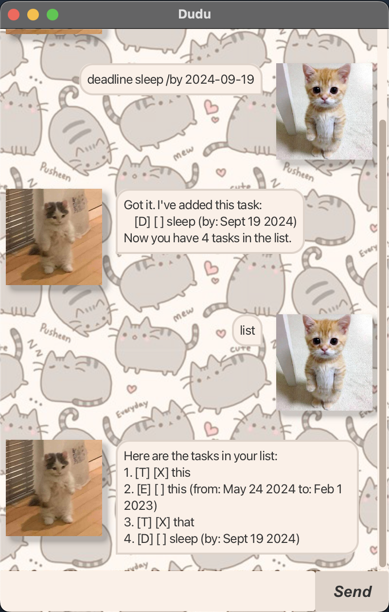

# Dudu User Guide



Dudu is a cat-themed Command Line Interface (CLI) task manager that also supports a Graphical User interface (GUI).

## Adding tasks `todo` `deadline` `event`

### Todo task `todo`
Task without a deadline.

Format: `todo [description]`

Example: `todo Prepare dinner`

Expected output:
```
Got it. I've added this task:
    [T] [ ] Prepare dinner
Now you have 1 tasks in the list.
```

### Deadline task `deadline`
Task with an end date.

Format: `deadline [description] /by [YYYY-MM-DD]`

Example: `deadline Eat dinner /by 2024-09-19`

Expected output:
```
Got it. I've added this task:
    [D] [ ] Eat dinner (by: Sept 19 2024)
Now you have 2 tasks in the list.
```

### Event task `event`
Task with start and end dates.

Format: `event [description] /from [YYYY-MM-DD] /to [YYYY-MM-DD]`

Example: `event Wash dishes /from 2024-09-19 /to 2024-09-19`

Expected output:
```
Got it. I've added this task:
    [E] [ ] Wash dishes (from: Sept 19 2024 to: Sept 19 2024)
Now you have 3 tasks in the list.
```

## Listing tasks `list`
View current tasks.

Format: `list`

Sample output:
```
Here are the tasks in your list:
1. [T] [ ] Prepare dinner
2. [D] [ ] Eat dinner (by: Sept 19 2024)
3. [E] [ ] Wash dishes (from: Sept 19 2024 to: Sept 19 2024)
```

## Marking task `mark`
Marks a task as completed.

Format: `mark [index]`

Example: `mark 2`

Expected output:
```
Nice! I've marked this task as done:
    [D] [X] Eat dinner (by: Sept 19 2024)
```

## Unmarking task `unmark`
Marks a task as uncompleted.

Format: `unmark [index]`

Example: `unmark 2`

Expected output:
```
Ok, I've marked this task as not done yet:
    [D] [ ] Eat dinner (by: Sept 19 2024)
```

## Deleting task `delete`
Deletes a task.

Format: `delete [index]`

Example: `delete 2`

Expected output:
```
Noted. I've removed this task:
    [D] [ ] Eat dinner (by: Sept 19 2024)
```

## Finding tasks `find`
Finds tasks with descriptions matching the query.

Format: `find [query1] [query2] ...`

Example: `find dinner`

Expected output:
```
Here are the matching tasks in your list:
1. [T] [ ] Prepare dinner
```

## Undo `undo`
Undoes the previous command.

Format: `undo`

Sample output:
```
You have successfully undone the previous command!
Got it. I've added this task:
    [D] [ ] Eat dinner (by: Sept 19 2024)
Now you have 3 tasks in your list.
```

## Quitting `bye`
Exits the application.

Format: `bye`

Expected output:
```
Bye. Hope to see you again soon!
```
